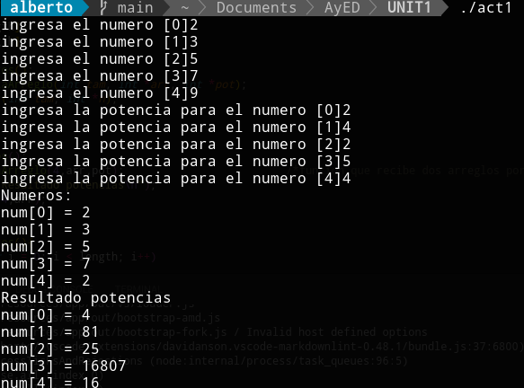
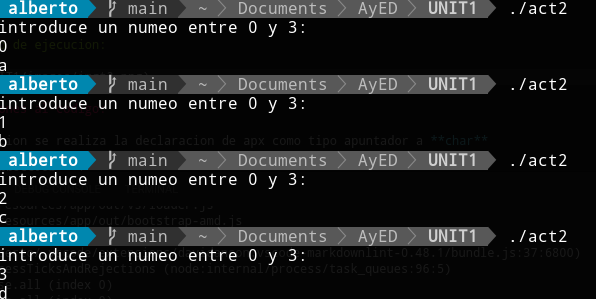
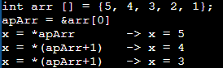
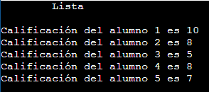

# Omega up

>Alberto Gutierrez Romero
> 2213027799

## Tarea 1 Ejercicio 1: 
> 

### Código:

```c
#include<stdio.h>
#include<math.h>
#define length 4

int arr[length];
int pot[length];

void leerDatos();
void potenciaArreglo(int tam, int *arr, int *pot);
void mostrar(int tam, int *n);

int main(){
    
    leerDatos();
    potenciaArreglo(4,arr,pot);                         /*funcion que recibe dos arreglos por referencia*/
    printf("Resultado potencias\n");
    mostrar(4,arr);
    
}
void leerDatos(){
    for (int i = 0; i < length; i++)
    {
        printf("ingresa el numero [%d]",i);
        scanf("%d",&arr[i]);
 
    }

    for (int i = 0; i < length; i++)
    {
        printf("ingresa la potencia para el numero [%d]",i);
        scanf("%d",&pot[i]); 
    }
    
}

void potenciaArreglo(int tam, int *arr, int *pot){
    printf("Numeros:\n");
    mostrar(tam,arr);
    for(int j=0; j<tam; j++){
         *(arr+j) =pow(*(arr+j),*(pot+j));
    }
       

}
void mostrar(int tam, int *n){
    {
    for(int j=0; j<tam; j++)
        printf("num[%d] = %d \n", j, *(n+j));
        //printf("%d ",*(n+j));
    }
}

```
### Resultado de ejecucion:



### Descripcion del codigo:

>Librerias utilizadas y constante que define el tamaño del arreglo

```c
#include<stdio.h>
#include<math.h>
#define length 4

```

> Declaracion de los arreglos para entrada de usuario
>
> arr: Almacena los numeros que ingresa el usuario
>
> pot: Almacena las potencias a las que se elevarán los numeros

```c
int arr[length];
int pot[length];

```
> Deficnion de las fucniones 
>
> ***leerDatos***: Permite ingresar los valores necesarios para hacer las operaciones 
>
> ***potenciaArreglo***: Esta funcion recibe el tamaño del arreglo como tipo entero , recibe tambien los 5 valores         ingresados por el usuario asi como los valores de las potencias
>
> ***mostrar*** : Permite visualizar en consola los valores elevados a la potencia definida por el usuario

```c
void leerDatos();
void potenciaArreglo(int tam, int *arr, int *pot);
void mostrar(int tam, int *n);
```
> Funcion main

```c
int main(){
    
    leerDatos();
    potenciaArreglo(4,arr,pot);                         /*funcion que recibe dos arreglos por referencia*/
    printf("Resultado potencias\n");
    mostrar(4,arr);
    
}

```

> Funcion ***void leerDatos()***
>
```c
void leerDatos(){
    // Se leen los numeros definidos por el usuario y se almacenan en arr[i]
    for (int i = 0; i < length; i++)
    {
        printf("ingresa el numero [%d]",i);
        scanf("%d",&arr[i]);
 
    }
    //Se leen las potencias y se almacenan en pot[i]
    for (int i = 0; i < length; i++)
    {
        printf("ingresa la potencia para el numero [%d]",i);
        scanf("%d",&pot[i]); 
    }
    
}
```

>Funcion ***void potenciaArreglo(int tam, int *arr, int *pot)***

```c

void potenciaArreglo(int tam, int *arr, int *pot){      //recibe la referencia de los arreglos  y un entero
    printf("Numeros:\n");
    mostrar(tam,arr);
    for(int j=0; j<tam; j++){
         *(arr+j) =pow(*(arr+j),*(pot+j));              //se realiza la operacion de potencia con los datos i de cada arreglo 
    }
```
>

```c

}
void mostrar(int tam, int *n){                          // recibe la referencia de un arreglo y un entero
    {
    for(int j=0; j<tam; j++)
        printf("num[%d] = %d \n", j, *(n+j));           // se imprimen los datos del arreglo utilizando la direccion del dato 
        
    }
}

```

## Tarea 1 Ejercicio 2: 


### Código:

```c
#include <stdio.h>

void f(char *apx, int n);
int main(){
    char x[]={'a','b','c','d'};
    char *apx=x; 
    int n;

    printf("introduce un numeo entre 0 y 3:\n");
    scanf("%d",&n);
    f(apx,n);

    return 0;
}

void f(char *apx, int n){
    printf("%c\n",*(apx+n));
}

```
### Resultado de ejecucion:



> Modificaciones al codigo:

En la correccion se realiza la declaracion de apx como tipo apuntador a **char**

|Error   |Correccion   |   
|---|---|
| ``char apx=x; `` | ``char *apx=x; `` | 

---
Se requiere guardar el valor entero ingresado por el usuario por lo que el operador correcto es: **&**

|Error   |Correccion   |   
|---|---|
| `scanf("%d",*n);` | ``scanf("%d",&n);``  | 

---
En la correccion se modifica el tipo de dato que recibe la funcion **f**, al ser un aputador se debe usar el operador:  **_*_** en el caso de pasar el parametro por referencia.

|Error   |Correccion   |   
|---|---|
| ``void f(char apx, int n){`` | ``void f(char *apx, int n){ `` | 


## Tarea 1 Ejercicio 3:

### Diferentes formas de acceder a los elementos de un arreglo:

> Apuntando a la direccion especifica de un elemento en un arreglo:

```c
#include<stdio.h>
/*
 Este programa accede a las localidades de memoria del arreglo  a
través de un apuntador.
*/
int main () {
 int c[10] = {5, 4, 3, 2, 1, 9, 8, 7, 6, 0};
 int *apEnt;
 

 printf(" c[10] = {5, 4, 3, 2, 1, 9, 8, 7, 6, 0}\n");

 apEnt = &c[0];
 printf("apEnt = &c[0] \t-> apEnt = %i\n", *apEnt);
 apEnt = &c[1];
 printf("apEnt = &c[1] \t-> apEnt = %i\n", *apEnt);

 return 34;
}
```

---

> Usando aritmetica de apuntadores:

```c
#include <stdio.h>

int main () {
 int arr [] = {5, 4, 3, 2, 1};
 int *apArr;
 apArr = arr;

 printf("int arr [] = {5, 4, 3, 2, 1};\n");
 printf("apArr = &arr[0]\n");

 int x = *apArr;
 printf("x = *apArr \t -> x = %d\n", x);

 x = *(apArr+1);
 printf("x = *(apArr+1) \t -> x = %d\n", x);

 x = *(apArr+2);
 printf("x = *(apArr+1) \t -> x = %d\n", x);

 return 0;
}

```


---


> A traves de un apuntador usando un ciclo for:
```c
#include <stdio.h>

int main (){
 #define TAMANO 5
 int lista [TAMANO] = {10, 8, 5, 8, 7};
 int *ap = lista;

 printf("\tLista\n");
 for (int indice = 0 ; indice < 5 ; indice++){
 printf("\nCalificación del alumno %d es %d", indice+1, *(ap+indice));
 }

 printf("\n");

 return 0;
}
```

---

> A traves de un indice  usando un ciclo for:
```c
#include <stdio.h>

int main (){
 #define TAMANO 5
 int lista [TAMANO] = {10, 8, 5, 8, 7};
 
  printf("\tLista\n");
 for (int indice = 0 ; indice < 5 ; indice++){
 printf("\nCalificación del alumno %d es %d", indice+1,lista[indice]);
 }

 printf("\n");

 return 0;
}
```

---
