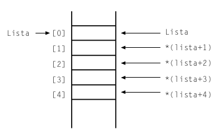

## APUNTADORES

### INICIALIZACION
C no inicializa los punteros cuando se declaran y es preciso inicializarlos antes de su uso. Después de la inicialización,
se puede utilizar el puntero para referenciar los datos direccionados. Para asignar una dirección de memoria a un pun-
tero se utiliza el operador `&` Este método de inicialización, denominado estático, requiere:

Asignar memoria estáticamente definiendo una variable y a continuación hacer que el puntero apunte al valor de la
variable.

* `int i;`      ***define una variable i***
* `int *p;`     ***define un puntero a un entero p***
* `p = &i;`     ***asigna la dirección de i a p***

>El operador `&` devuelve la dirección de la variable a la cual se aplica.

### PUNTERO NULLO Y VOID

Un puntero nulo no apunta a ningún dato válido; se utiliza para proporcionar a un programa un medio de conocer cuándo una variable puntero no direcciona a un dato válido.
Para declarar un puntero nulo se utiliza la macro NULL.

>* Un puntero nulo no direcciona ningún dato válido. Un puntero void direcciona datos de un tipo no especifi-
> cado. Un puntero void se puede igualar a nulo si no se direcciona ningún dato válido. NULL es un valor; void
> es un tipo de dato.

>* Un puntero puede apuntar a otra variable puntero. Para declarar un puntero a un puntero se hace preceder a la
>variable con dos asteriscos ``**``.

### PUNTEROS Y ARREGLOS

Los arrays y los punteros están fuertemente relacionados en el lenguaje C. El nombre de un array es un puntero, contiene la dirección en memoria de comienzo de la secuencia de elementos que forma el array. Es un puntero constante ya que no se puede modificar, sólo se puede acceder para indexar a los elementos del array. Si se tiene la siguiente declaración de un array, el siguiente codigo representa un arreglo almacenado en memoria.

``int lista[5] = {10, 20, 30, 40, 50};``

